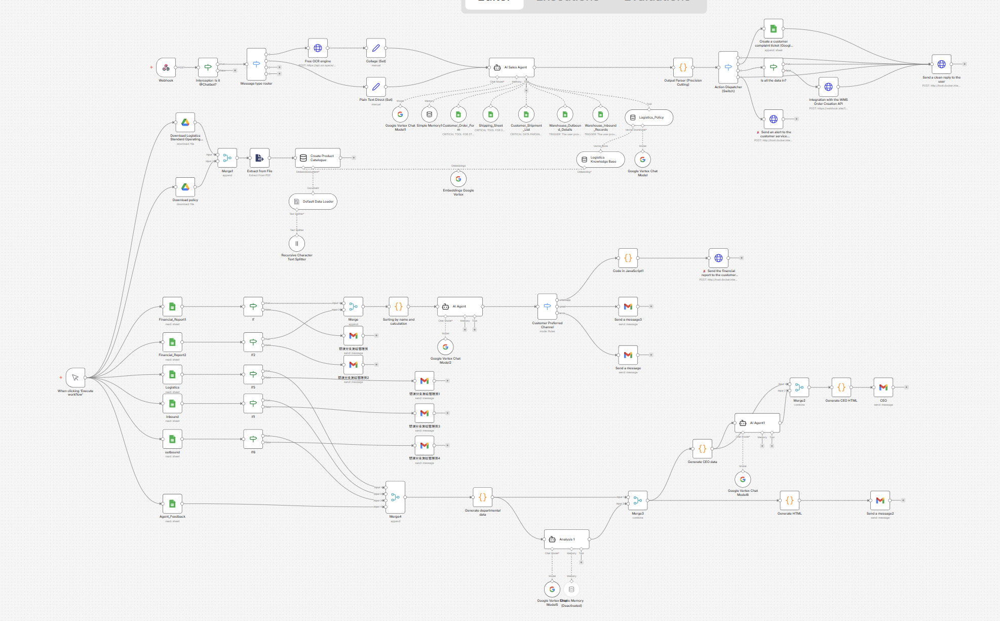

# 全球物流 AI 助手 + 自动化财务报告系统

> 基于 n8n + LLM + WhatsApp 构建的物流行业一体化自动化解决方案：智能客服机器人 + 三层架构财务周报自动化工作流。



---

##  项目简介

本项目面向物流行业，解决两大核心痛点：

1. **客服效率低**：人工跨系统查单、处理投诉、录入订舱信息，响应慢、易出错。
2. **财务周报耗时**：人工跨表格汇总数据、计算指标、画图、写分析、排版、发邮件，流程长且数据容易出错。

为此设计了两套打通数据的自动化系统：

-  **物流 AI 智能客服助手**：基于 WhatsApp + LLM + n8n，覆盖查单、投诉处理、主动订舱、人工升级四大场景，并自动推送财务报表。
-  **三层架构自动化财务报表工作流**：数据整合 → 指标生成 → 报表生成分发，替代人工制表，支持部门版 / 高管版双口径输出。

二者共享底层数据，形成「客服 + 财务」一体化自动化体系。

---

##  系统架构

```
┌─────────────────────────────────────────────────────────────┐
│                     用户交互层（WhatsApp）                    │
│              扫码连接 → 自然语言交互 → LLM 理解意图              │
└───────────────────────────┬─────────────────────────────────┘
                            │
                ┌───────────▼────────────┐
                │      n8n 自动化引擎      │
                └───────────┬────────────┘
        ┌────────┬──────────┼──────────┬────────┐
        ▼        ▼          ▼          ▼        ▼
   动作A:查询  动作B:投诉  动作C:订舱  动作D:转人工  财务报表推送
   (Google     (工单自动   (后台自动   (危机检测+    (按客户联系
    Sheets)     录入)      生成)      主管同步)     方式分发)
```

### 财务报表三层架构

```
第一层：数据整合层 (Merge)
   入库数据 + 出库数据 + 物流单据数据 + 客户反馈数据
                    │
                    ▼
第二层：指标生成层
   数据规整 → 关键指标预计算 → 图表素材生成 → 前置数据校验
                    │
                    ▼
第三层：报表生成分发层
   AI 生成结构化周报 → ① 部门版 HTML（推送部门经理）
                     → ② 高管版 HTML（CEO 核心数据，供管理层决策）
```

三层完全解耦：新增部门 / 调整指标 / 升级为在线看板，只需改动对应分层，无需重构整体流程。

---

##  核心功能

### 一、物流 AI 智能客服助手（Chatbot）

| 模块 | 功能描述 |
|------|---------|
| **业务数据查询** | 用户咨询运费成本，系统自动调取原始数据表回复；支持输入 RK 订单编号直接读取 Google Sheets，回填收货时间、货品数量等 Inbound 系统数据；支持客户订单表单自动校验 |
| **投诉自动处理** | 自动生成工单录入客服台账，先自动回复客户、留存留言，再识别投诉核心原因，全程自动归档 |
| **主动订舱（Proactive Booking）** | 用户录入订舱资料后，系统在后台瞬间生成标准化物流出货信息，免人工二次录入 |
| **人工升级转接** | 识别高风险/危机问题后自动切换危机模式：先致歉，再触发人工专员介入，同步推送消息给主管 |
| **财务报表自动推送** | 基于已存储的客户手机号/邮箱，AI 整合财务数据完成分析后，简易明细推送至 WhatsApp，完整详情推送至邮箱 |

### 二、自动化财务报表工作流

- 统一对接四大数据源，消除系统割裂
- 关键业务指标自动预计算，前置数据校验避免 AI 分析与原始数据冲突
- 部门版 / 高管版双口径 HTML 报表，自动定向分发

---

##  业务价值

| 维度 | 收益 |
|------|------|
| **运营效率** ⬆️ | 省去跨表格、跨系统人工核对，大幅减少重复操作 |
| **运营成本** ⬇️ | 客服、财务标准化工作自动化，削减人力投入 |
| **客户体验** ⬆️ | AI 即时响应咨询/投诉/订舱，等待时长大幅缩短 |
| **回款管理** ⬆️ | 自动生成分发对账汇总报表，推动财务跟进流程 |

**与普通问答机器人的区别**：不止于问答，能够完整执行业务逻辑、打通真实业务全流程；架构高度可复制，可批量迁移到更多客户、仓库、客服场景——定位是**可规模化落地的一体化自动化业务解决方案**，而非单一聊天工具。

---

## 🛠️ 技术栈

- **自动化引擎**：[n8n](https://n8n.io/)
- **AI 能力**：LLM Agent（意图理解 / 投诉归因 / 周报分析生成）
- **交互渠道**：WhatsApp（扫码接入）
- **数据源**：Google Sheets（入库 Inbound 系统等）
- **报表输出**：HTML 邮件报表（部门版 / 高管版）

>  以下为待补充信息，建议根据实际情况修改：
> - 具体使用的 LLM 模型/服务商 - gemini-2.5-flash
> - WhatsApp 接入方式（第三方网关）
> - 工单系统对接方式 - 投诉处理节点通过 Google Sheets 节点的 append（追加行） 操作，把投诉信息写入一张 Google Sheet 表格，以此作为轻量级工单台账——并没有对接 Jira/Zendesk 等专业工单系统。

---

##  快速开始

```bash
# 1. 克隆仓库
git clone <你的仓库地址>
cd <项目目录>

# 2. 启动 n8n
npx n8n
# 或使用 Docker
docker run -it --rm -p 5678:5678 n8nio/n8n

# 3. 导入工作流
# 在 n8n 界面中导入 workflows/ 目录下的 .json 文件

# 4. 配置凭证
# - Google Sheets OAuth2（需在 Google Cloud Console 配置 OAuth 同意屏幕 + 重定向 URI）
# - WhatsApp 渠道凭证
# - LLM API Key

# 5. 扫码激活 WhatsApp，开始测试
```

---

## 📹 演示视频

- RK 订单查询演示：自动回填收货时间、货品数量
- 客户订单表单校验演示

> 视频链接
>https://xmueducn-my.sharepoint.com/:v:/g/personal/cst2309186_xmu_edu_my/IQBnSI02UrYTQKhtnUgr2RAuAYVGfJZbMNWYrZ6-BM6utus?nav=eyJyZWZlcnJhbEluZm8iOnsicmVmZXJyYWxBcHAiOiJPbmVEcml2ZUZvckJ1c2luZXNzIiwicmVmZXJyYWxBcHBQbGF0Zm9ybSI6IldlYiIsInJlZmVycmFsTW9kZSI6InZpZXciLCJyZWZlcnJhbFZpZXciOiJNeUZpbGVzTGlua0NvcHkifX0&e=Vbqoo0

---

## 项目结构

```
.
├── workflows/              # n8n 工作流 JSON 导出文件
│   ├── chatbot-whatsapp.json
│   ├── finance-layer1-merge.json
│   ├── finance-layer2-metrics.json
│   └── finance-layer3-report.json
├── docs/                    # 文档、截图、演示视频
├── README.md
└── LICENSE
```


> 本项目为团队分享项目，由三位发言人分别讲解客服功能、财务工作流设计与业务价值总结。
